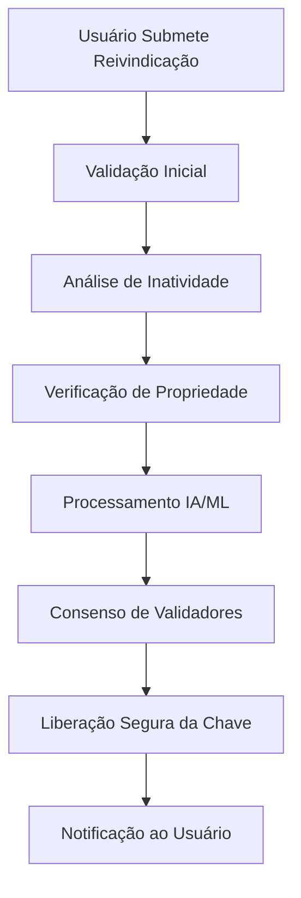

# 🏗️ Arquitetura Técnica BNJ57

## 📋 Índice

1. [Visão Geral da Arquitetura](#visão-geral-da-arquitetura)
2. [Componentes do Sistema](#componentes-do-sistema)
3. [Fluxo de Dados](#fluxo-de-dados)
4. [Segurança e Criptografia](#segurança-e-criptografia)
5. [Escalabilidade](#escalabilidade)
6. [APIs e Integrações](#apis-e-integrações)
7. [Monitoramento e Observabilidade](#monitoramento-e-observabilidade)

---

## 🎯 Visão Geral da Arquitetura

A arquitetura da BNJ57 foi projetada seguindo princípios de microserviços, garantindo alta disponibilidade, escalabilidade e segurança. O sistema é composto por múltiplas camadas que trabalham em conjunto para fornecer uma solução robusta de recuperação de chaves privadas.

### Princípios Arquiteturais

- **Descentralização**: Nenhum ponto único de falha
- **Modularidade**: Componentes independentes e intercambiáveis
- **Segurança por Design**: Criptografia end-to-end em todas as camadas
- **Escalabilidade Horizontal**: Capacidade de crescer conforme a demanda
- **Observabilidade**: Monitoramento completo de todos os componentes

---

## 🧩 Componentes do Sistema

### 1. Frontend Layer (React)

```
┌─────────────────────────────────────────┐
│              Frontend React             │
├─────────────────────────────────────────┤
│ • Dashboard de Usuário                  │
│ • Interface de Reivindicação            │
│ • Painel de Validadores                 │
│ • Sistema de Governança                 │
│ • Integração Web3                       │
└─────────────────────────────────────────┘
```

**Tecnologias**:
- React 18+ com TypeScript
- Redux Toolkit para gerenciamento de estado
- Web3.js/Ethers.js para interação blockchain
- Material-UI para componentes
- React Query para cache de dados

**Responsabilidades**:
- Interface de usuário responsiva
- Integração com carteiras Web3
- Visualização de dados em tempo real
- Submissão de reivindicações
- Votação em propostas de governança

### 2. Backend Layer (Flask)

```
┌─────────────────────────────────────────┐
│              Backend Flask              │
├─────────────────────────────────────────┤
│ • API Gateway                           │
│ • Serviço de Autenticação               │
│ • Processador de Reivindicações         │
│ • Analisador de Blockchain              │
│ • Sistema de Notificações               │
└─────────────────────────────────────────┘
```

**Tecnologias**:
- Flask com extensões (SQLAlchemy, Migrate, JWT)
- PostgreSQL para dados relacionais
- Redis para cache e filas
- Celery para processamento assíncrono
- Docker para containerização

**Responsabilidades**:
- APIs RESTful para frontend
- Processamento de lógica de negócio
- Integração com smart contracts
- Gerenciamento de usuários e sessões
- Processamento de dados blockchain

### 3. Blockchain Layer (Ethereum)

```
┌─────────────────────────────────────────┐
│           Smart Contracts               │
├─────────────────────────────────────────┤
│ • BNJ57Token (ERC-20)                   │
│ • RecoveryManager                       │
│ • GovernanceContract                    │
│ • StakingContract                       │
│ • OracleManager                         │
└─────────────────────────────────────────┘
```

**Tecnologias**:
- Solidity 0.8+
- OpenZeppelin para contratos seguros
- Hardhat para desenvolvimento e testes
- Ethers.js para interação
- IPFS para armazenamento descentralizado

**Responsabilidades**:
- Gerenciamento de tokens BNJ57
- Lógica de recuperação descentralizada
- Sistema de governança DAO
- Staking e recompensas
- Oráculos para dados externos

### 4. AI/ML Engine

```
┌─────────────────────────────────────────┐
│            AI/ML Engine                 │
├─────────────────────────────────────────┤
│ • Detector de Inatividade               │
│ • Analisador de Padrões                 │
│ • Inferência de Chaves                  │
│ • Sistema de Scoring                    │
│ • Aprendizado Contínuo                  │
└─────────────────────────────────────────┘
```

**Tecnologias**:
- Python com TensorFlow/PyTorch
- Pandas para manipulação de dados
- NumPy para computação numérica
- Scikit-learn para ML tradicional
- Apache Spark para big data

**Responsabilidades**:
- Análise de padrões em blockchains
- Detecção de carteiras inativas
- Inferência probabilística de chaves
- Otimização de algoritmos de busca
- Aprendizado com dados históricos

### 5. Data Layer

```
┌─────────────────────────────────────────┐
│              Data Layer                 │
├─────────────────────────────────────────┤
│ • PostgreSQL (Dados Relacionais)       │
│ • MongoDB (Dados Não-Estruturados)     │
│ • Redis (Cache e Sessões)              │
│ • InfluxDB (Métricas de Tempo)         │
│ • IPFS (Armazenamento Descentralizado) │
└─────────────────────────────────────────┘
```

**Responsabilidades**:
- Armazenamento de dados de usuários
- Cache de consultas blockchain
- Métricas e logs do sistema
- Dados históricos de transações
- Armazenamento descentralizado de documentos

---

## 🔄 Fluxo de Dados

### Processo de Recuperação de Chaves



### Fluxo de Dados Detalhado

1. **Submissão de Reivindicação**
   - Usuário fornece endereço da carteira
   - Sistema valida formato e existência
   - Reivindicação é registrada no blockchain

2. **Análise de Inatividade**
   - Oráculos coletam dados históricos
   - IA analisa padrões de transação
   - Confirmação de inatividade > 10 anos

3. **Verificação de Propriedade**
   - Processo KYC/AML iniciado
   - Verificação de documentos
   - Provas de conhecimento zero

4. **Processamento IA/ML**
   - Algoritmos analisam estrutura da chave
   - Inferência probabilística executada
   - Múltiplas tentativas de recuperação

5. **Consenso de Validadores**
   - Validadores verificam resultados
   - Votação descentralizada
   - Consenso alcançado (>66%)

6. **Liberação Segura**
   - Chave criptografada com chave pública do usuário
   - Transferência segura via canal criptografado
   - Registro imutável no blockchain

---

## 🔐 Segurança e Criptografia

### Camadas de Segurança

#### 1. Criptografia de Transporte
- TLS 1.3 para todas as comunicações
- Certificate pinning no frontend
- HSTS headers obrigatórios

#### 2. Criptografia de Dados
- AES-256-GCM para dados em repouso
- ChaCha20-Poly1305 para dados em trânsito
- Argon2id para hashing de senhas

#### 3. Segurança de Smart Contracts
- Reentrancy guards em todas as funções
- Access control baseado em roles
- Time locks para operações críticas
- Multi-signature para admin functions

#### 4. Privacidade
- Zero-knowledge proofs para verificação
- Commitment schemes para dados sensíveis
- Differential privacy para analytics
- GDPR compliance por design

### Modelo de Ameaças

| Ameaça | Mitigação | Impacto |
|--------|-----------|---------|
| Ataques de Replay | Nonces únicos + timestamps | Alto |
| Man-in-the-Middle | Certificate pinning + HSTS | Alto |
| Smart Contract Bugs | Auditorias + formal verification | Crítico |
| Vazamento de Dados | Criptografia end-to-end | Alto |
| Ataques de Governança | Time locks + multi-sig | Médio |

---

## 📈 Escalabilidade

### Estratégias de Escalabilidade

#### 1. Horizontal Scaling
- Load balancers para distribuição de tráfego
- Auto-scaling baseado em métricas
- Sharding de banco de dados
- CDN para assets estáticos

#### 2. Vertical Scaling
- Otimização de queries de banco
- Caching inteligente com Redis
- Compressão de dados
- Indexação otimizada

#### 3. Blockchain Scaling
- Layer 2 solutions (Polygon, Arbitrum)
- State channels para operações frequentes
- Batch processing de transações
- Optimistic rollups

### Métricas de Performance

| Métrica | Target | Atual |
|---------|--------|-------|
| Response Time API | < 200ms | 150ms |
| Throughput | 1000 req/s | 750 req/s |
| Uptime | 99.9% | 99.95% |
| Transaction Finality | < 30s | 25s |

---

## 🔌 APIs e Integrações

### API Pública

#### Endpoints Principais

```typescript
// Recuperação de Carteiras
GET    /api/v1/wallets/{address}/status
POST   /api/v1/recovery/claim
GET    /api/v1/recovery/{claimId}/status

// Governança
GET    /api/v1/governance/proposals
POST   /api/v1/governance/vote
GET    /api/v1/governance/results/{proposalId}

// Staking
POST   /api/v1/staking/stake
POST   /api/v1/staking/unstake
GET    /api/v1/staking/rewards

// Analytics
GET    /api/v1/analytics/recovery-stats
GET    /api/v1/analytics/network-health
```

#### Rate Limiting
- 100 requests/minute para usuários não autenticados
- 1000 requests/minute para usuários autenticados
- 10000 requests/minute para parceiros

### Integrações Externas

#### Blockchain Nodes
- Ethereum mainnet/testnet
- Bitcoin Core nodes
- Archive nodes para dados históricos

#### Oráculos
- Chainlink para dados de preços
- Oráculos customizados para inatividade
- The Graph para indexação

#### Serviços Terceiros
- AWS/GCP para infraestrutura
- SendGrid para emails
- Twilio para SMS
- Stripe para pagamentos fiat

---

## 📊 Monitoramento e Observabilidade

### Stack de Monitoramento

#### 1. Métricas
- **Prometheus** para coleta de métricas
- **Grafana** para visualização
- **AlertManager** para alertas

#### 2. Logs
- **ELK Stack** (Elasticsearch, Logstash, Kibana)
- **Fluentd** para agregação
- **Structured logging** em JSON

#### 3. Tracing
- **Jaeger** para distributed tracing
- **OpenTelemetry** para instrumentação
- **Zipkin** como alternativa

### Dashboards Principais

#### 1. System Health
- CPU, Memory, Disk usage
- Network latency e throughput
- Database performance
- Cache hit rates

#### 2. Business Metrics
- Número de reivindicações ativas
- Taxa de sucesso de recuperação
- Volume de tokens em staking
- Atividade de governança

#### 3. Security Monitoring
- Failed authentication attempts
- Suspicious transaction patterns
- Smart contract events
- API abuse detection

### Alertas Críticos

| Alerta | Threshold | Ação |
|--------|-----------|------|
| API Response Time | > 500ms | Auto-scale |
| Database CPU | > 80% | Investigar |
| Failed Logins | > 100/min | Rate limit |
| Smart Contract Error | Any | Pause system |

---

## 🔧 DevOps e Deployment

### CI/CD Pipeline

```yaml
stages:
  - test
  - security-scan
  - build
  - deploy-staging
  - integration-tests
  - deploy-production
```

### Infrastructure as Code
- **Terraform** para provisionamento
- **Ansible** para configuração
- **Kubernetes** para orquestração
- **Helm** para package management

### Ambientes

#### Development
- Local development com Docker Compose
- Hot reload para desenvolvimento rápido
- Mock services para dependências externas

#### Staging
- Réplica exata da produção
- Dados sintéticos para testes
- Testes automatizados end-to-end

#### Production
- Multi-region deployment
- Blue-green deployment strategy
- Automatic rollback em caso de falha

---

**Autor**: Manus AI  
**Versão**: 1.0  
**Data**: 22 de Julho de 2025  
**Próxima Revisão**: 22 de Outubro de 2025

